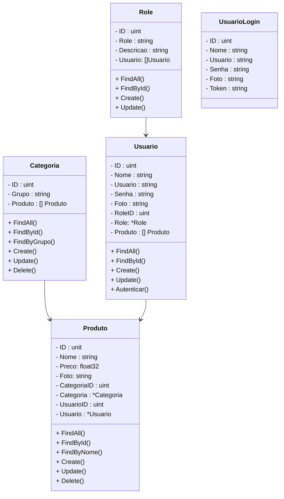

# Projeto Farmácia - Rest API
 

     
     

  

Este projeto é um sistema de gerenciamento para farmácias, do tipo MVP, implementado através da Linguagem Go. O sistema visa fornecer uma solução robusta e eficiente para o controle de estoque e gestão de Usuários em estabelecimentos farmacêuticos.

 

## Principais Características

1. **Gestão de Estoque**: 
   - Cadastro e atualização de medicamentos
   - Organização por grupo de medicamentos
3. **Gestão de Usuários - Clientes e Fornecedores**: 
   - Cadastro de clientes e fornecedores
   - Envio de e-mail de confirmação do cadastro
4. **Segurança**: 
   - Autenticação via Usuário e Senha
   - Criação e Validação de Token JWT com tempo de expiração
   - Controle de Nível de Acesso (Roles) por tipo de usuário

 

## Principais Tecnologias Utilizadas

- **Linguagem**: Go
- **Bancos de Dados**:
  - MySQL (Desenvolvimento)
  - Sqlite (Execução de Testes)
  -  PostgreSQL (Deploy - Render)

- **Framework Web**: Fiber
- **Configuração do ambiente:** Air e Viper
- **ORM**: GORM
- **Validação de dados:** Go Validator 10
- **Testes:** Testfy
- **Documentação:** Swago
- **Deploy:** Render

 

## Arquitetura

O projeto segue uma arquitetura em camadas, separando as responsabilidades em:

- Controladores (handlers para requisições HTTP)
- Serviços (lógica de negócios)
- Repositórios (interação com o banco de dados)
- Modelos (estruturas de dados)

Esta arquitetura promove a manutenibilidade e escalabilidade do sistema.

 

## Diagrama de Classes

  

## Tarefas Concluídas

- [x] Criação do Projeto - Fiber Framework
- [x] Conexão com o Banco de dados MySQL
- [x] Configuração das Rotas
- [x] CRUD de Produto
- [x] CRUD de Categoria
- [x] Relacionamento Produto - Categoria
- [x] CRUD do Usuario
- [x] Relacionamento Produto - Usuario
- [x] Security
- [x] Testes E2E
  - [x] Usuario
  - [x] Categoria
  - [x] Produto
- [x] Swagger
- [x] Deploy no Render
- [x] Refatoramento - Service e Controller
- [x] Envio de E-mails
- [x] Direitos de Acesso (Roles)

  

# Referências sobre Golang

 

<a href="https://go.dev/" target="_blank">Site Oficial - Golang</a>

<a href="https://go.dev/doc/" target="_blank">Documentação Oficial - Golang</a>

<a href="https://pkg.go.dev/" target="_blank">Repositório de pacotes Oficial - Golang</a>

<a href="https://docs.gofiber.io/" target="_blank">Fiber - web Framework - Golang</a>

<a href="https://github.com/air-verse/air" target="_blank">Air - Gerenciador de Autoinicialização do Servidor - Golang</a>

<a href="https://github.com/spf13/viper" target="_blank">Viper - Gerenciador de configurações da API - Golang</a>

<a href="https://gorm.io/" target="_blank">GORM - Mapeamento Objeto Relacional - Golang</a>

<a href="https://github.com/go-playground/validator" target="_blank">Go Validator V10 - Validação de dados - Golang</a>

<a href="https://pkg.go.dev/encoding/json" target="_blank">Go JSON - Golang</a>

<a href="https://github.com/golang-jwt/jwt-docs" target="_blank">Golang JWT - Autenticação com Token JWT - Versão 5.0 - Golang</a>

<a href="https://github.com/stretchr/testify?tab=readme-ov-file" target="_blank">Golang Testify - Testes E2E - Versão 2.0 - Golang</a>

