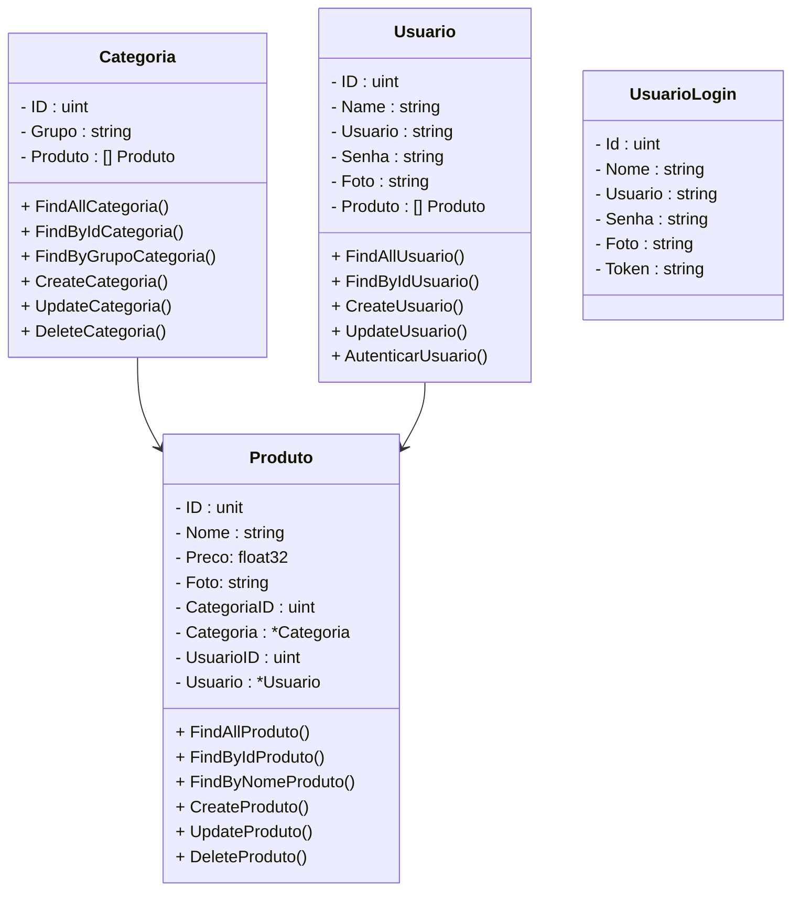

# Projeto Farmácia (Em desenvolvimento)

 

     
     

  

## Diagrama de Classes

  

## Tarefas Concluídas

- [x] Criação do Projeto - Fiber Framework
- [x] Conexão com o Banco de dados MySQL
- [x] Configuração das Rotas
- [x] CRUD de Produto
- [x] CRUD de Categoria
- [x] Relacionamento Produto - Categoria
- [x] CRUD do Usuario
- [x] Relacionamento Produto - Usuario
- [x] Security
- [x] Testes E2E
  - [x] Usuario
  - [x] Categoria
  - [x] Produto
- [x] Swagger
- [x] Deploy no Render
- [x] Refatoramento - Service e Controller
- [x] Envio de E-mails

  

# Referências sobre Golang

 

<a href="https://go.dev/" target="_blank">Site Oficial - Golang</a>

<a href="https://go.dev/doc/" target="_blank">Documentação Oficial - Golang</a>

<a href="https://pkg.go.dev/" target="_blank">Repositório de pacotes Oficial - Golang</a>

<a href="https://gorm.io/" target="_blank">Biblioteca GORM - Mapeamento Objeto Relacional - Golang</a>

<a href="https://github.com/spf13/viper" target="_blank">Pacote Viper - Gerenciador de configurações da API - Golang</a>

<a href="https://pkg.go.dev/encoding/json" target="_blank">Pacote JSON - Golang</a>

<a href="https://github.com/go-playground/validator" target="_blank">Go Validator V10 - Validação de dados - Golang</a>

<a href="https://github.com/golang-jwt/jwt-docs" target="_blank">Golang JWT - Autenticação com Token JWT - Versão 5.0 - Golang</a>
